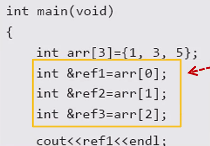

# CPP

## 1일차
### cpp 입출력 [text](iot-cpp/02/cpp01/main.cpp)
1. stdin 
    - std::cin 사용 
2. stdout
    - std::cout 사용 
### 함수오버로딩 
1. 같은 함수 이름에서 매개 변수로 구별하는 것
2. 함수 구별 기준
    - 기존 c에서는 함수명으로 구별
    - cpp에서는 함수명과 매개변수로 구별함
    - 출력값은 구별하지 않음
        - void func(int)와 int func(int)는 같은 함수

### 매개변수 디폴트 값 [text](iot-cpp/02/app03/main.cpp)
1. 함수호출시 매개변수를 전달하지 않으면 디폴트 값으로 설정된 매개변수로 동작
2. 디폴트 값은 선언부분에 위치해야한다.
    - 메인함수 아랫부분에 디폴트 값을 설정할 경우 컴파일러가 이해하지 못함
3. 디폴트 값을 줄 경우 오른쪽부터 채워야한다 
    - 왼쪽부터 줄 경우 컴파일 에러 발생
    - int func(int n = 10, int b ) -- 불가능
    - int func(int a, int b = 10) -- 가능

### 인라인 함수 [text](iot-cpp/02/cpp04/main.cpp)
1. 매크로 함수의 장점을 취하고 단점을 보완한 함수
    - 매크로 함수는 자료형을 지정할 필요가 없지만 인라인 함수는 필요하다.
2. inline 선언을 해도 인라인 처리 되지 않을 수 있다.
3. inline 선언을 하지 않아도 인라인처리 될 수 있다.

### namespace [text](iot-cpp/02/untitled/main.cpp)
1. namespace를 사용하여 동일한 이름을 가진 함수를 다른 공간에 분리 가능
    - cout cin endl 등등 기본함수도 std라는 네임스페이스에 존재함
2. namespace {name}으로 선언 하여 사용시 name::(함수 변수명 )으로 사용
3. using namespace std 는 std:: 없이 std라는 이름공간에 접근하겠다는 뜻
    - using namespace를 막 사용할 경우 충돌이 발생할 수 있으니 제한적으로 사용

### 객체지향언어의 특징
- 상속, 다형성, 객체, 캡슐화 등 소프트웨어의 재사용을 위함
- 실세계에 대한 쉬운 모델링

### 포인터 상수, 상수 포인터 [text](iot-cpp/02/cpp05/main.cpp)
1. 포인터 상수
    - int* const ptr
        - 포인터의 주소 값 자체를 변경 할 수 없음
2. 상수 포인터
    - const int* ptr
        - 포인터가 접근하는 변수의 값을 ptr 로는 변경할 수 없음
3. 상수 포인터 상수
    - const int* const ptr
        - ptr의 값(주소)를 변경할 수 없고 ptr이 접근하는 변수의 값도 변경 불가

### 참조자
1. 포인터와 비슷
2. int &num1 = num2 식으로 사용
3. 여러개 선언 가능
    - int &num3 = num2;
    - int &num1 = num2;
    - 처럼 여러개 선언 가능함
4. 포인터와 달리 변수로만 초기화 가능
    - 상수, 널 같은 걸론 초기화 불가능
    - 생성과 동시에 초기화 해야함

5. 배열의 각 요소로 초기화 가능
    - 

6. 포인터 변수에도 참조 가능 [text](iot-cpp/02/cpp07/main.cpp)
    - int*(&ref)로 선언하는 이유는 포인터와 자료형을 맞춰주기 위해서
    - 이중포인터일 경우 int **(&ref2)로 선언 

